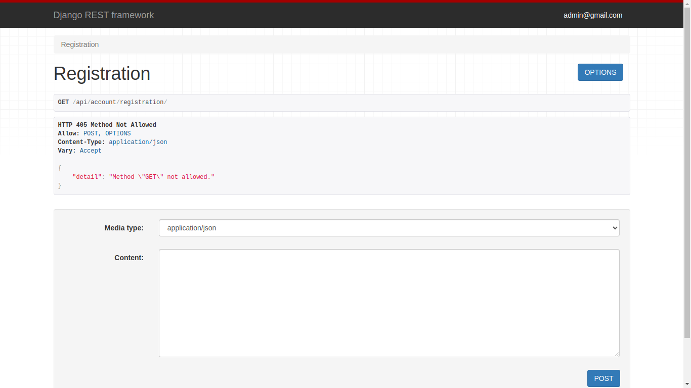
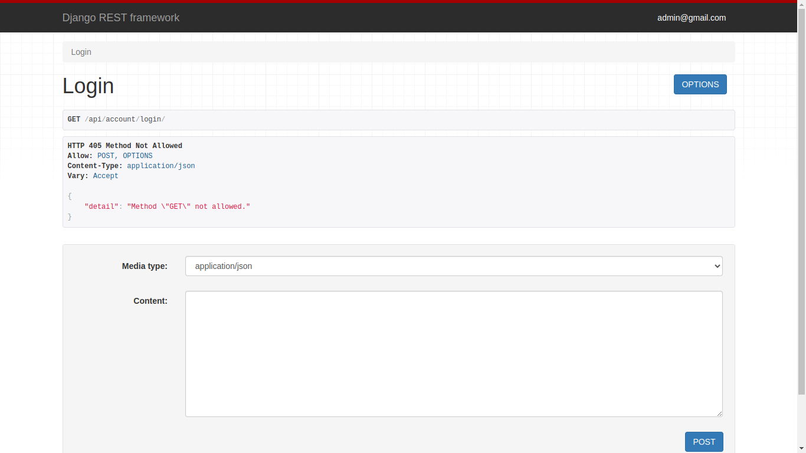
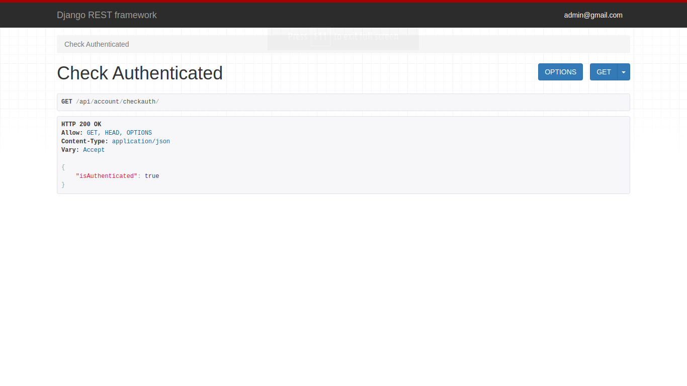
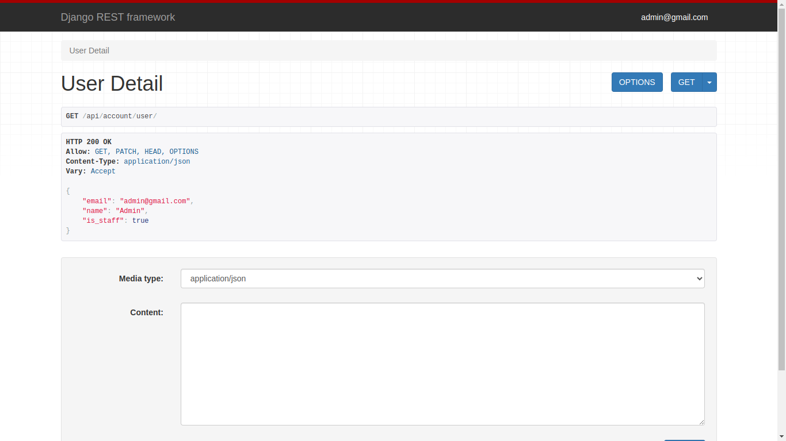

# DRF Account

DRF Account is a Django Rest Framework project designed to provide user authentication functionalities such as account creation, login, delete, update, email verification, password change, etc.

## Getting Started

Follow these steps to get the project up and running on your local machine.

### Prerequisites

Make sure you have the following installed on your machine:

- Python (version 3.x)
- pip (Python package installer)

### Installation

1. Clone the repository to your local machine using the following command:

    ```
    git clone https://github.com/Yyuichiii/DRF_Account.git
    ```

2. Navigate to the project directory:

    ```
    cd DRF_Account
    ```

3. Install the project dependencies by running:

    ```
    pip install -r requirements.txt
    ```

### Usage

1. Once the installation is complete, migrate the database:

    ```
    python manage.py migrate
    ```

2. Run the development server:

    ```
    python manage.py runserver
    ```
    
3. Configure Details in .env file for email service activation.

4. Open your web browser and go to [http://127.0.0.1:8000/](http://127.0.0.1:8000/) to view the project.

### API Endpoints

- `/api/account/checkauth/`: Check authentication status
- `/api/account/registration/`: User registration
- `/api/account/login/`: User login
- `/api/account/user/`: Retrieve user detail
- `/api/account/change_password/`: Change user password
- `/api/account/delete/`: Delete user account
- `/api/account/logout/`: User logout


### Screenshots






### Contributing

Contributions are welcome! Please feel free to open a pull request or issue for any bugs, feature requests, or suggestions.

### License

This project is licensed under the MIT License - see the [LICENSE](LICENSE) file for details.

### Acknowledgments

- Hat tip to anyone whose code was used
- Inspiration
- etc.
